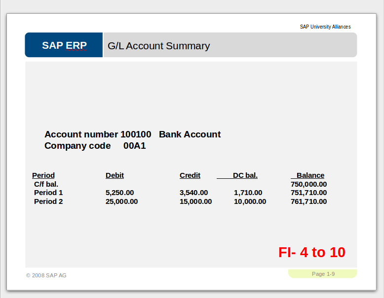
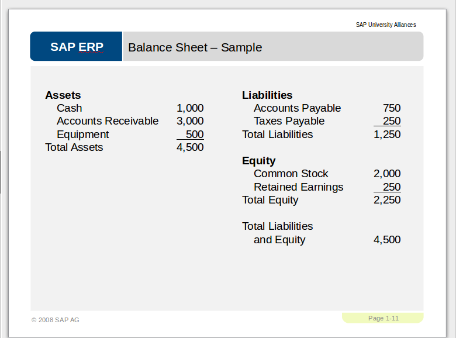

# Topic 2: Accounting

## The important part!!

### Financial Accounting (FI) VS Management Accounting (CO)
    
Financial Accounting
- **External** accounting (reports are meant for external parties)
- Deals with all transactions that have **financial impact** (P/L, account balances)
- Required **By Law** (FI reports must be submitted to the authority)
- Fixed report **formats set by authority**

Management Accounting
- **Internal** Accounting (reports are meant for internal parties)
- Mainly deals with **cost**
- **Not legally required**
- Report formats are **flexible.**

Accounting is the **main point** of ERP!

### General Ledger

_General Ledger?_
: _The_ General Ledger is a **data storage area** (simply put, a **list**) consisting of a **culmination** of unique combinations of Company Codes and Chart of Accounts. Each G/L entry in the General Ledger will have an **account balance** value

#### Data in a General Ledger entry
- General Ledger Account ID
- Short Description Text
- Whether it is a Debit or Credit account
- Amount in the currency as stated in the G/L
- Amount in the local currency of the current user
- Document Date
- Currency
- Posting Date
- Reference
- Document Header Text
- Cross-CC no
- Company Code

#### General Ledger Account Summary

### Chart of Accounts

: Simply a group of General Ledger (G/L) accounts, of which includes:
  - Revenue
  - COGS
  - Tax
  - General expenses
  - Fixed Asset
  - Current Asset
  - etc

  The G/L accounts inside the chart of accounts are can be used by one or more company codes

### Balance sheet

Representation of the organization's:

- Assets _"owns" / gross value_--> Assets = Liabilities + Equity
- Liabilities _"owes"_
- Equity _"rightfully owns without debt / net value"_ --> Equity = Assets - Liabilities

------------

## Not important part

- Every year, every business in this world must submit financial reports (e.g. **profit & loss statement**, **balance sheet**) to the authority (tax department e.g. IRAS in Singapore). If you make money, you gotta pay tax. Government computes the tax payable based on your revenue. (profit = revenues - expenses)

- This is why every **transaction** that has financial impact must be **correctly recorded** into company's **ledger** (this is just like a DB table used to store **transaction data**).

- At the end of each financial period, the data in the **ledger** will be **extracted and summarized** to prepare the financial reports. These reports are **required by law**.

- Without ERP system, the recording of transactions that have financial impact must done manually. e.g. in the sales process, there are 3 transactions that have financial impact i.e. 
  (i) goods issue posting (VL02N)
      - less goods -> less assets
  (ii) Invoice Posting
     - Customer officially owes you money -> more asset (A/R)
 (iii) Receive payment
     - Customer pay you money -> more asset (cash)
Without ERP, staff working for the finance department will have record these 3 transactions into their book and ledger (or accounting software) manually. Imagine you have 10,000 sales per day.. how many accounting staff must you employ?

With ERP, the recording of the transactions with financial impact is done automatically in the background. You do not need to know what is debit, what is credit. ERP system is always setup by certified accountant. Whenever you post a transaction that has financial impact, the system automatically record the affected amount ($) into the respective general ledger (G/L) accounts. The crediting and debiting will be decided by the system itself. At the end of the financial period, financial reports can be generated with just a few mouse clicks.

### Things tested in this topic

- All (exc Org Obj).
- Notepad on FI v Management Accounting