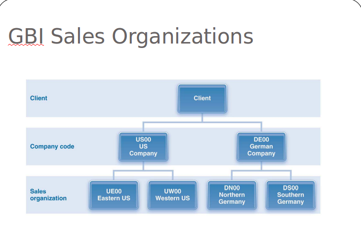
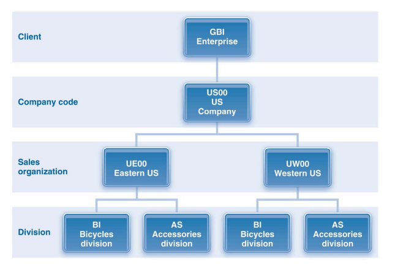
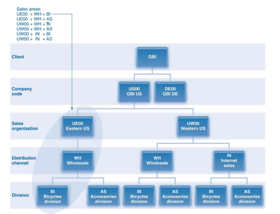

# Topic 4: Fulfillment

## The Fulfillment Process

> Remember the **IMPACTS**!!

1. _Sales_ receives customer's **Purchase Order**
    - Pre-sales Activity is a requirement before this step
        + Receiving RFQ
        + Creating Quotation
2. _Sales_ creates **Sales Order**
    - i.e. **Sales Order Processing**
3. _Warehouse_ picks & packs **Shipment**
    - i.e. **Inventory Sourcing**
4. _Warehouse_ ships **Shipment**
    - i.e. **Post Goods Issue**
    - Financial Impacts
        + **General Ledger** accounts updated:
            * CREDIT Inventory-finished/Inventory-trading goods
            * DEBIT Cost of goods sold
        + **Controlling Document** created
        + **Billing Due List** updated
    - Material Impacts
        + **Material Document** created
5. _Accounting_ sends **Invoice**
    - i.e. **Billing**
    - Financial Impacts
        + **General Ledger** accounts updated:
            * DEBIT Customer & receivable-reconciliation (linked)
            * CREDIT Company's Sales Revenue
        + **Sales Document status** updated
        + **Controlling Document** created
6. _Accounting_ receives **Payment**
    - Financial Impacts
        + **General Ledger** accounts updated
            * DEBIT Company's Bank Account
            * BALANCE OUT DEBIT (i.e. CREDIT) Customer & receivable-reconciliation

## Organizational Data

### Sales Organization

> 1 Company Code (country) : Many Sales Organizations

Each sales organization's responsibilities pertain to a certain geographic area within a Company Code's country (e.g. West Singapore, Central Singapore)

**Responsible for:**
- Distributes goods & services
- Negotiates sales conditions
- Product liability & rights of recourse

### Distribution Channel

> 1 Sales Organization : Many Distribution Channels
> Not all sales orgz have all 3 distribution channel types

**Distribution Strategies / Distribution Channel Types:**
- Wholesale
- Retail
- Internet

**Responsible for:**
- Getting materials to customers

### Division

> Many Sales organization : Many Divisions

**Responsible for:**
- Consolidating similar materials for sale

### Sales Area

A **Sales Area** represents each possible unique combination of Sales Organizations, Distribution Channels and Divisions

## Master Data

- Material Master
- Customer Master
- Customer-Material Info Record
    + Associative data for mapping Materials to Customers
- Conditions
    + Prices, Discounts, Surcharges, Shipping Fees, Legal bindings
- Output Master Data
    + All the documents as a result of the fulfillment process, i.e.:
        * Quotation, Order Confirmation, Invoices, Mails, Emails
- Credit Management Master Record
    + Ties Customer-Master Info Record with credit amount, address & communication info

### Things to study

- Basic Fulfillment Process + Material Impact, Financial Impact
- Sales Org
- Distribution Channel
- Division 
- Sales Area == prev 3
- Master Data